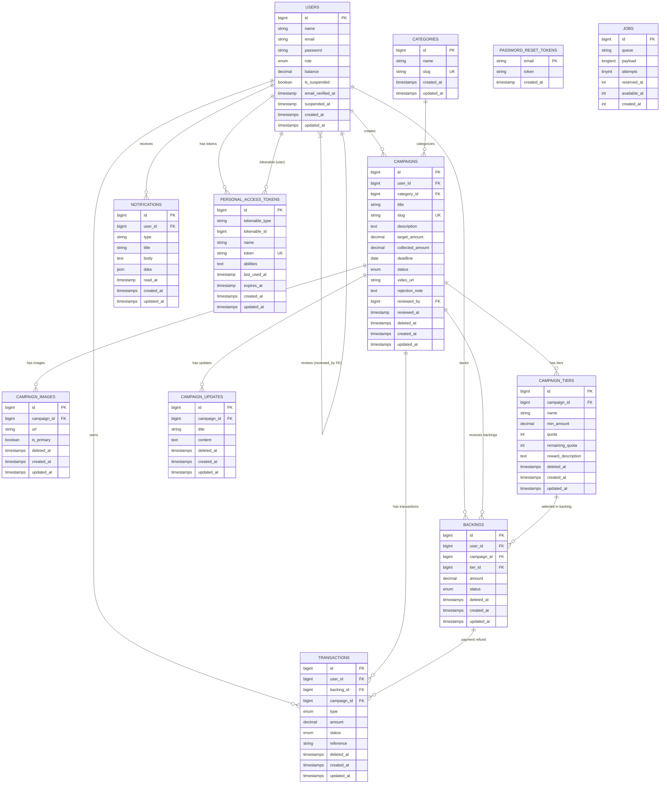

# CoFund API — Dokumentasi Database & Skema ERD

> Dokumentasi lengkap skema database CoFund Crowdfunding Platform (Laravel 10 + MySQL 8).

---

## 1. Diagram ERD (Entity Relationship Diagram)

Berikut adalah entitas (entity) dan relasinya dalam format **Mermaid.js `erDiagram`** yang dapat dirender langsung di GitHub, VS Code (extension Merlin/Mermaid), dan editor markdown lain yang mendukung:



---

## 2. Kamus Data & Struktur Tabel

### 2.1 Tabel `users`

| Kolom | Tipe Data | Nullable | Default | Key | Deskripsi |
|---|---|---|---|---|---|
| `id` | BIGINT(unsigned) AUTO_INCREMENT | NOT NULL | - | **PK** | Primary key pengguna |
| `name` | VARCHAR(255) | NOT NULL | - | - | Nama lengkap pengguna |
| `email` | VARCHAR(255) | NOT NULL | - | **UNIQUE** | Email unik, tidak boleh duplikat |
| `password` | VARCHAR(255) | NOT NULL | - | - | Password yang sudah di-hash (bcrypt) |
| `role` | ENUM('backer','creator','admin') | NOT NULL | `'backer'` | - | Peran pengguna |
| `balance` | DECIMAL(15,2) | NOT NULL | `0.00` | - | Saldo dompet virtual pengguna |
| `is_suspended` | TINYINT(1) BOOLEAN | NOT NULL | `0` (false) | - | Status penangguhan akun |
| `email_verified_at` | TIMESTAMP | YES | NULL | - | Timestamp verifikasi email |
| `suspended_at` | TIMESTAMP | YES | NULL | - | Timestamp penangguhan |
| `remember_token` | VARCHAR(100) | YES | NULL | - | Token "remember me" |
| `created_at` | TIMESTAMP | YES | NULL | - | Timestamp pembuatan |
| `updated_at` | TIMESTAMP | YES | NULL | - | Timestamp pembaruan terakhir |

---

### 2.2 Tabel `categories`

| Kolom | Tipe Data | Nullable | Default | Key | Deskripsi |
|---|---|---|---|---|---|
| `id` | BIGINT(unsigned) AUTO_INCREMENT | NOT NULL | - | **PK** | Primary key kategori |
| `name` | VARCHAR(255) | NOT NULL | - | - | Nama kategori |
| `slug` | VARCHAR(255) | NOT NULL | - | **UNIQUE** | Slug unik kategori |
| `deleted_at` | TIMESTAMP | YES | NULL | - | Soft delete |
| `created_at` | TIMESTAMP | YES | NULL | - | Timestamp pembuatan |
| `updated_at` | TIMESTAMP | YES | NULL | - | Timestamp pembaruan |

---

### 2.3 Tabel `campaigns`

| Kolom | Tipe Data | Nullable | Default | Key | Deskripsi |
|---|---|---|---|---|---|
| `id` | BIGINT(unsigned) AUTO_INCREMENT | NOT NULL | - | **PK** | Primary key kampanye |
| `user_id` | BIGINT(unsigned) | NOT NULL | - | **FK** → `users.id` | Kreator kampanye |
| `category_id` | BIGINT(unsigned) | NOT NULL | - | **FK** → `categories.id` | Kategori |
| `title` | VARCHAR(100) | NOT NULL | - | - | Judul kampanye |
| `slug` | VARCHAR(255) | NOT NULL | - | **UNIQUE** | Slug unik URL-friendly |
| `description` | TEXT | NOT NULL | - | - | Deskripsi (Markdown) |
| `target_amount` | DECIMAL(15,2) | NOT NULL | - | - | Target dana |
| `collected_amount` | DECIMAL(15,2) | NOT NULL | `0.00` | - | Dana terkumpol |
| `deadline` | DATE | NOT NULL | - | - | Deadline kampanye |
| `status` | ENUM('draft','review','active','success','failed') | NOT NULL | `'draft'` | - | Status kampanye |
| `video_url` | VARCHAR(255) | YES | NULL | - | URL video pendukung |
| `rejection_note` | TEXT | YES | NULL | - | Catatan penolakan |
| `reviewed_by` | BIGINT(unsigned) | YES | NULL | **FK** → `users.id` | Admin yang review |
| `reviewed_at` | TIMESTAMP | YES | NULL | - | Timestamp review |
| `deleted_at` | TIMESTAMP | YES | NULL | - | Soft delete |
| `created_at` | TIMESTAMP | YES | NULL | - | Timestamp pembuatan |
| `updated_at` | TIMESTAMP | YES | NULL | - | Timestamp pembaruan |

**Indexes tambahan:** `FULLTEXT(title, description)` — untuk pencarian fulltext

---

### 2.4 Tabel `campaign_images`

| Kolom | Tipe Data | Nullable | Default | Key | Deskripsi |
|---|---|---|---|---|---|
| `id` | BIGINT(unsigned) AUTO_INCREMENT | NOT NULL | - | **PK** | Primary key |
| `campaign_id` | BIGINT(unsigned) | NOT NULL | - | **FK** → `campaigns.id` (CASCADE) | kampanye terkait |
| `url` | VARCHAR(255) | NOT NULL | - | - | Path file di storage |
| `is_primary` | TINYINT(1) BOOLEAN | NOT NULL | `0` (false) | - | Apakah primary/cover |
| `deleted_at` | TIMESTAMP | YES | NULL | - | Soft delete |
| `created_at` | TIMESTAMP | YES | NULL | - | Timestamp |
| `updated_at` | TIMESTAMP | YES | NULL | - | Timestamp |

---

### 2.5 Tabel `campaign_tiers`

| Kolom | Tipe Data | Nullable | Default | Key | Deskripsi |
|---|---|---|---|---|---|
| `id` | BIGINT(unsigned) AUTO_INCREMENT | NOT NULL | - | **PK** | Primary key |
| `campaign_id` | BIGINT(unsigned) | NOT NULL | - | **FK** → `campaigns.id` (CASCADE) | kampanye terkait |
| `name` | VARCHAR(255) | NOT NULL | - | - | Nama tier |
| `min_amount` | DECIMAL(15,2) | NOT NULL | - | - | Jumlah minimum dukungan |
| `quota` | INT | NOT NULL | `0` | - | Kuota maksimum (0 = unlimited) |
| `remaining_quota` | INT | NOT NULL | `0` | - | Kuota tersisa |
| `reward_description` | TEXT | NOT NULL | - | - | Deskripsi reward |
| `deleted_at` | TIMESTAMP | YES | NULL | - | Soft delete |
| `created_at` | TIMESTAMP | YES | NULL | - | Timestamp |
| `updated_at` | TIMESTAMP | YES | NULL | - | Timestamp |

---

### 2.6 Tabel `campaign_updates`

| Kolom | Tipe Data | Nullable | Default | Key | Deskripsi |
|---|---|---|---|---|---|
| `id` | BIGINT(unsigned) AUTO_INCREMENT | NOT NULL | - | **PK** | Primary key |
| `campaign_id` | BIGINT(unsigned) | NOT NULL | - | **FK** → `campaigns.id` (CASCADE) | kampanye terkait |
| `title` | VARCHAR(255) | NOT NULL | - | - | Judul update |
| `content` | TEXT | NOT NULL | - | - | Konten (Markdown) |
| `deleted_at` | TIMESTAMP | YES | NULL | - | Soft delete |
| `created_at` | TIMESTAMP | YES | NULL | - | Timestamp |
| `updated_at` | TIMESTAMP | YES | NULL | - | Timestamp |

---

### 2.7 Tabel `backings`

| Kolom | Tipe Data | Nullable | Default | Key | Deskripsi |
|---|---|---|---|---|---|
| `id` | BIGINT(unsigned) AUTO_INCREMENT | NOT NULL | - | **PK** | Primary key |
| `user_id` | BIGINT(unsigned) | NOT NULL | - | **FK** → `users.id` (CASCADE) | Backer |
| `campaign_id` | BIGINT(unsigned) | NOT NULL | - | **FK** → `campaigns.id` (CASCADE) | kampanye |
| `tier_id` | BIGINT(unsigned) | YES | NULL | **FK** → `campaign_tiers.id` | Tier yang dipilih |
| `amount` | DECIMAL(15,2) | NOT NULL | - | - | Jumlah dukungan |
| `status` | ENUM('pending','completed','refunded') | NOT NULL | `'pending'` | - | Status backing |
| `deleted_at` | TIMESTAMP | YES | NULL | - | Soft delete |
| `created_at` | TIMESTAMP | YES | NULL | - | Timestamp |
| `updated_at` | TIMESTAMP | YES | NULL | - | Timestamp |

---

### 2.8 Tabel `transactions`

| Kolom | Tipe Data | Nullable | Default | Key | Deskripsi |
|---|---|---|---|---|---|
| `id` | BIGINT(unsigned) AUTO_INCREMENT | NOT NULL | - | **PK** | Primary key |
| `user_id` | BIGINT(unsigned) | NOT NULL | - | **FK** → `users.id` (CASCADE) | Pemilik transaksi |
| `backing_id` | BIGINT(unsigned) | YES | NULL | **FK** → `backings.id` | Backing terkait |
| `campaign_id` | BIGINT(unsigned) | YES | NULL | **FK** → `campaigns.id` | kampanye terkait |
| `type` | ENUM('payment','refund','disbursement','platform_fee','deposit','withdrawal') | NOT NULL | `'payment'` | - | Tipe transaksi |
| `amount` | DECIMAL(15,2) | NOT NULL | - | - | Jumlah |
| `status` | ENUM('pending','success','failed') | NOT NULL | `'pending'` | - | Status transaksi |
| `reference` | VARCHAR(255) | YES | NULL | - | Nomor referensi unik |
| `deleted_at` | TIMESTAMP | YES | NULL | - | Soft delete |
| `created_at` | TIMESTAMP | YES | NULL | - | Timestamp |
| `updated_at` | TIMESTAMP | YES | NULL | - | Timestamp |

---

### 2.9 Tabel `notifications`

| Kolom | Tipe Data | Nullable | Default | Key | Deskripsi |
|---|---|---|---|---|---|
| `id` | BIGINT(unsigned) AUTO_INCREMENT | NOT NULL | - | **PK** | Primary key |
| `user_id` | BIGINT(unsigned) | NOT NULL | - | **FK** → `users.id` (CASCADE) | Penerima notifikasi |
| `type` | VARCHAR(255) | NOT NULL | - | - | Tipe notifikasi |
| `title` | VARCHAR(255) | NOT NULL | - | - | Judul |
| `body` | TEXT | NOT NULL | - | - | Isi notifikasi |
| `data` | JSON | YES | NULL | - | Data tambahan (JSON) |
| `read_at` | TIMESTAMP | YES | NULL | - | Timestamp dibaca |
| `created_at` | TIMESTAMP | YES | NULL | - | Timestamp |
| `updated_at` | TIMESTAMP | YES | NULL | - | Timestamp |

---

### 2.10 Tabel `personal_access_tokens`

| Kolom | Tipe Data | Nullable | Default | Key | Deskripsi |
|---|---|---|---|---|---|
| `id` | BIGINT(unsigned) AUTO_INCREMENT | NOT NULL | - | **PK** | Primary key |
| `tokenable_type` | VARCHAR(255) | NOT NULL | - | - | Morph type (misal: `App\Models\User`) |
| `tokenable_id` | BIGINT(unsigned) | NOT NULL | - | **INDEX** (composite) | Morph ID |
| `name` | VARCHAR(255) | NOT NULL | - | - | Nama token |
| `token` | VARCHAR(64) | NOT NULL | - | **UNIQUE** | Token hash |
| `abilities` | TEXT | YES | NULL | - | JSON array abilities |
| `last_used_at` | TIMESTAMP | YES | NULL | - | Timestamp terakhir dipakai |
| `expires_at` | TIMESTAMP | YES | NULL | - | Timestamp kadaluarsa |
| `created_at` | TIMESTAMP | YES | NULL | - | Timestamp |
| `updated_at` | TIMESTAMP | YES | NULL | - | Timestamp |

**Composite Index:** `tokens_tokenable_type_tokenable_id_index` (`tokenable_type`, `tokenable_id`)

---

### 2.11 Tabel `password_reset_tokens`

| Kolom | Tipe Data | Nullable | Default | Key | Deskripsi |
|---|---|---|---|---|---|
| `email` | VARCHAR(255) | NOT NULL | - | **PK** | Email pengguna |
| `token` | VARCHAR(255) | NOT NULL | - | - | Token reset |
| `created_at` | TIMESTAMP | YES | NULL | - | Timestamp dibuat |

---

### 2.12 Tabel `jobs`

| Kolom | Tipe Data | Nullable | Default | Key | Deskripsi |
|---|---|---|---|---|---|
| `id` | BIGINT(unsigned) AUTO_INCREMENT | NOT NULL | - | **PK** | Primary key |
| `queue` | VARCHAR(255) | NOT NULL | - | **INDEX** | Nama queue |
| `payload` | LONGTEXT | NOT NULL | - | - | Payload job (serialized) |
| `attempts` | TINYINT(unsigned) | NOT NULL | - | - | Jumlah percobaan |
| `reserved_at` | INT(unsigned) | YES | NULL | - | Timestamp reserved |
| `available_at` | INT(unsigned) | NOT NULL | - | - | Timestamp tersedia |
| `created_at` | INT(unsigned) | NOT NULL | - | - | Timestamp pembuatan |

---

## 3. Enum & Status State Machine

### 3.1 Enum Status kampanye (`campaigns.status`)

| Nilai | Nama | Deskripsi |
|---|---|---|
| `draft` | Draft | Baru dibuat — dapat diedit oleh creator |
| `review` | Review | Menunggu persetujuan admin |
| `active` | Aktif | kampanye live, dapat menerima backing |
| `success` | Sukses | Target tercapai sebelum deadline |
| `failed` | Gagal | Deadline lewat, target tidak tercapai |

### 3.2 State Machine kampanye

```
           +--------+
           |  draft |
           +---+----+
               |
      (submit for review)
               |
               v
           +--------+
           | review |
           +---+----+
               |
      +--------+--------+
      |                 |
  (approve)          (reject)
      |                 |
      v                 v
  +---------+       +--------+
  | active  |       |  draft | <--- kembali untuk diedit ulang
  +----+----+       +--------+
       |
       | (deadline lewat)
       v
       +---------------------------+
       |                           |
   (collected >= target)        (collected < target)
       |                           |
       v                           v
  +----------+               +---------+
  | success  |               | failed  |
  +----------+               +---------+
       |                           |
  (DisburseCampaignJob)     (RefundBackersJob)
  - creator balance +=      - backer balance +=
    95% collected              refund amount
  - create disbursement       - create refund tx
    tx + platform_fee tx      - mark backing
                              as refunded

[force-fail by admin] -> failed -> RefundBackersJob
```

### 3.3 Enum Status Backing (`backings.status`)

| Nilai | Deskripsi |
|---|---|
| `pending` | Backing dibuat, menunggu konfirmasi |
| `completed` | Pembayaran sukses, dana di escrow |
| `refunded` | Dana dikembalikan (kampanye gagal) |

### 3.4 Enum Tipe Transaksi (`transactions.type`)

| Nilai | Deskripsi |
|---|---|
| `payment` | Backer melakukan backing — dana ke escrow |
| `refund` | Pengembalian dana ke backer |
| `disbursement` | Pencairan dana ke creator |
| `platform_fee` | Potongan biaya platform (5%) |
| `deposit` | Deposit ke dompet pengguna |
| `withdrawal` | Withdrawal dari dompet pengguna |
| --- | --- |
| **Catatan** | Tipe `deposit` dan `withdrawal` sudah termasuk di enum pada migration awal. Migration lanjutan (`2026_08_27_000000_update_type_enum_in_transactions_table.php`) telah dihapus karena sudah ter-integrasi. |

### 3.5 Enum Status Transaksi (`transactions.status`)

| Nilai | Deskripsi |
|---|---|
| `pending` | Transaksi sedang diproses |
| `success` | Transaksi berhasil |
| `failed` | Transaksi gagal |

### 3.6 Enum Peran Pengguna (`users.role`)

| Nilai | Deskripsi |
|---|---|
| `backer` | Pengguna yang mendukung kampanye |
| `creator` | Pengguna yang membuat kampanye |
| `admin` | Pengelola platform |

---

## 4. Relasi Eloquent & Integrity Rules

### 4.1 Relasi Eloquent

| Model | Relasi | Model Terhubung | Foreign Key | Type |
|---|---|---|---|---|
| `User` | `campaigns()` | `Campaign` | `user_id` | HasMany |
| `User` | `backings()` | `Backing` | `user_id` | HasMany |
| `User` | `transactions()` | `Transaction` | `user_id` | HasMany |
| `User` | `notifications()` | `Notification` | `user_id` | HasMany |
| `Campaign` | `creator()` | `User` | `user_id` | BelongsTo |
| `Campaign` | `reviewer()` | `User` | `reviewed_by` | BelongsTo |
| `Campaign` | `category()` | `Category` | `category_id` | BelongsTo |
| `Campaign` | `images()` | `CampaignImage` | `campaign_id` | HasMany |
| `Campaign` | `tiers()` | `CampaignTier` | `campaign_id` | HasMany |
| `Campaign` | `updates()` | `CampaignUpdate` | `campaign_id` | HasMany |
| `Campaign` | `backings()` | `Backing` | `campaign_id` | HasMany |
| `Campaign` | `transactions()` | `Transaction` | `campaign_id` | HasMany |
| `CampaignTier` | `campaign()` | `Campaign` | `campaign_id` | BelongsTo |
| `CampaignTier` | `backings()` | `Backing` | `tier_id` | HasMany |
| `CampaignImage` | `campaign()` | `Campaign` | `campaign_id` | BelongsTo |
| `CampaignUpdate` | `campaign()` | `Campaign` | `campaign_id` | BelongsTo |
| `Backing` | `backer()` | `User` | `user_id` | BelongsTo |
| `Backing` | `campaign()` | `Campaign` | `campaign_id` | BelongsTo |
| `Backing` | `tier()` | `CampaignTier` | `tier_id` | BelongsTo |
| `Backing` | `transactions()` | `Transaction` | `backing_id` | HasMany |
| `Transaction` | `user()` | `User` | `user_id` | BelongsTo |
| `Transaction` | `backing()` | `Backing` | `backing_id` | BelongsTo |
| `Transaction` | `campaign()` | `Campaign` | `campaign_id` | BelongsTo |
| `Notification` | `user()` | `User` | `user_id` | BelongsTo |

### 4.2 Cascading & Delete Rules

| Foreign Key | Table | On Delete | Deskripsi |
|---|---|---|---|
| `user_id` | `campaigns` | CASCADE | Hapus kampanye saat user dihapus |
| `category_id` | `campaigns` | RESTRICT | Kategori wajib ada |
| `reviewed_by` | `campaigns` | SET NULL | Set NULL saat admin dihapus |
| `campaign_id` | `campaign_images` | CASCADE | Hapus gambar saat kampanye dihapus |
| `campaign_id` | `campaign_tiers` | CASCADE | Hapus tier saat kampanye dihapus |
| `campaign_id` | `campaign_updates` | CASCADE | Hapus update saat kampanye dihapus |
| `user_id` | `backings` | CASCADE | Hapus backing saat user dihapus |
| `campaign_id` | `backings` | CASCADE | Hapus backing saat kampanye dihapus |
| `tier_id` | `backings` | SET NULL | Set NULL saat tier dihapus |
| `user_id` | `transactions` | CASCADE | Hapus transaksi saat user dihapus |
| `backing_id` | `transactions` | SET NULL | Set NULL saat backing dihapus |
| `campaign_id` | `transactions` | SET NULL | Set NULL saat kampanye dihapus |
| `user_id` | `notifications` | CASCADE | Hapus notifikasi saat user dihapus |
| `user_id` | `password_reset_tokens` | — | Primary key (email) |
| `campaign_id` | `campaign_tiers` | CASCADE | (sudah tercantum di atas) |

### 4.3 Unique & Index Constraints

| Tabel | Kolom | Constraint | Deskripsi |
|---|---|---|---|
| `users` | `email` | UNIQUE | Email unik per pengguna |
| `categories` | `slug` | UNIQUE | Slug unik per kategori |
| `campaigns` | `slug` | UNIQUE | Slug unik per kampanye |
| `campaigns` | `title, description` | FULLTEXT | Index pencarian fulltext |
| `personal_access_tokens` | `token` | UNIQUE | Token hash unik |
| `personal_access_tokens` | `tokenable_type, tokenable_id` | INDEX | Composite index untuk relasi polymorphic |
| `password_reset_tokens` | `email` | PRIMARY | Primary key berupa email |
| `jobs` | `queue` | INDEX | Index untuk filtering queue |

### 4.4 Soft Deletes

Soft deletes (`deleted_at` kolom) diterapkan pada tabel berikut:

- `categories`
- `campaigns`
- `campaign_images`
- `campaign_tiers`
- `campaign_updates`
- `backings`
- `transactions`

Model-model ini menggunakan trait `Illuminate\Database\Eloquent\SoftDeletes`, sehingga penghapusan bersifat lunak (tidak benar-benar menghapus record, hanya meng-set `deleted_at`).

---

## Ringkasan

Dokumentasi ini mencakup:
- **12 tabel utama** termasuk `personal_access_tokens`, `password_reset_tokens`, dan `jobs`
- **11 relasi Eloquent** yang terhubung antar entitas
- **6 enum** (campaign status, backing status, transaction type, transaction status, user role)
- **State machine kampanye** lengkap dari draft ke success/failed
- **Cascading rules** untuk integritas data referensial
- **Soft deletes** pada 7 tabel
- **Unique constraints** dan **index** untuk performa dan integritas