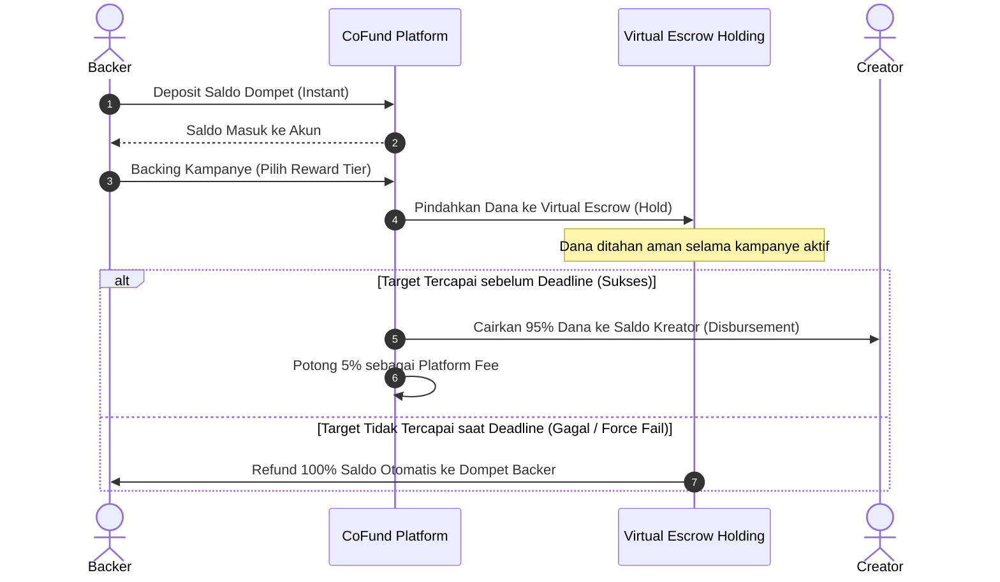

# Arsitektur Sistem CoFund

Dokumen ini menjelaskan gambaran arsitektur sistem **CoFund**, sebuah platform *Crowdfunding FinTech* modern berbasis *Decoupled Architecture* (pemisahan penuh antara backend REST API dan frontend Single Page Application) dengan protokol *Virtual Escrow* terintegrasi.

---

## 1. Topologi Arsitektur (Decoupled System)

CoFund menggunakan pola arsitektur **Decoupled (Headless)**:
- **Backend**: Laravel 10+ murni sebagai Stateless JSON REST API.
- **Frontend**: Vue 3 SPA (Single Page Application) dibangun dengan Vite, Tailwind CSS v3, PrimeVue v4 (Aura Preset), dan Pinia State Management.

```
┌─────────────────────────────────────────────────────────────┐
│                      Client Browser                         │
│   Vue 3 SPA (Vite + Pinia + Vue Router + Tailwind CSS v3)   │
└──────────────────────────────┬──────────────────────────────┘
                               │ HTTPS / JSON REST API
                               │ Authorization: Bearer <Sanctum Token>
┌──────────────────────────────▼──────────────────────────────┐
│                    Laravel 10 API Server                    │
│  ┌───────────────────────────────────────────────────────┐  │
│  │                    Route Layer                        │  │
│  │  routes/api.php (v1 Prefix + Middleware Guards)       │  │
│  └───────────────────────────┬───────────────────────────┘  │
│  ┌───────────────────────────▼───────────────────────────┐  │
│  │                  Controller Layer                     │  │
│  │  Menerima HTTP Request, delegate ke Service Layer     │  │
│  └───────────────────────────┬───────────────────────────┘  │
│  ┌───────────────────────────▼───────────────────────────┐  │
│  │                   Service Layer                       │  │
│  │  Business Logic (Wallet, Campaign, Stats, Backing)    │  │
│  └───────────────────────────┬───────────────────────────┘  │
│  ┌───────────────────────────▼───────────────────────────┐  │
│  │               Model & Database Layer                  │  │
│  │  Eloquent ORM, Scopes, Accessors, Virtual Escrow DB   │  │
│  └───────────────────────────────────────────────────────┘  │
└──────────────────────────────┬──────────────────────────────┘
                               │
                      MySQL Database Server
```

---

## 2. Alur Autentikasi & Otorisasi (Sanctum Token)

### Alur Login & Token Bearer:
1. Client mengirimkan payload `{ email, password }` ke `POST /api/v1/login`.
2. Laravel memvalidasi kredensial via `AuthService` dan menerbitkan **Sanctum Personal Access Token**.
3. Response mengembalikan data user beserta plain-text token.
4. Client (Vue 3) menyimpan token di `localStorage` (`cofund_token`) dan menyematkannya pada setiap request HTTP melalui Axios Request Interceptor:
   ```http
   Authorization: Bearer 1|xxxxxxxxxxxxxxxxxxxxxxxxxxxx
   Accept: application/json
   ```

### Alur Role-Based Access Control (RBAC):
Sistem membagi pengguna ke dalam 3 Role utama:
- **`backer` (Donatur)**: Default role saat registrasi. Dapat mengisi saldo dompet, menarik saldo, mendanai kampanye aktif (*backing*), dan melihat mutasi transaksi.
- **`creator` (Inisiator)**: Pengguna yang telah melakukan *Upgrade to Creator*. Dapat membuat kampanye draf, mengelola paket reward (*tiers*), mengunggah foto, menulis blog kabar proyek (*updates*), dan melihat statistik performa kampanye.
- **`admin` (Administrator)**: Pengelola platform. Dapat menyetujui (*approve*), menolak (*reject*), atau membatalkan (*force-fail*) kampanye, mengelola pengguna (*suspend/unsuspend*), serta memantau statistik platform dan perolehan fee (5%).

---

## 3. Protokol Virtual Escrow & Alur Dana

CoFund mengimplementasikan perlindungan dana donatur dengan sistem **Virtual Escrow**:



---

## 4. Struktur Direktori Proyek

```
COfund/
├── backend/                  # Laravel 10 REST API
│   ├── app/
│   │   ├── Enums/            # Status & Type Enums
│   │   ├── Events/           # Domain Events
│   │   ├── Http/
│   │   │   ├── Controllers/Api/ # API Controllers
│   │   │   ├── Middleware/   # Role & Auth Middleware
│   │   │   ├── Requests/     # Form Requests Validation
│   │   │   └── Resources/    # JSON Resource Shapes
│   │   ├── Jobs/             # Queue Jobs (Refund, Disburse)
│   │   ├── Models/           # Eloquent Models
│   │   └── Services/         # Encapsulated Business Logic Layer
│   ├── database/migrations/  # Database Table Schemas
│   └── routes/api.php        # API Route Definitions
│
├── frontend/                 # Vue 3 Single Page Application
│   ├── src/
│   │   ├── assets/           # CSS & Fonts
│   │   ├── components/       # Reusable UI & Domain Components
│   │   ├── composables/      # Reactive Composables (useAuth, useWallet, dll)
│   │   ├── layouts/          # MainLayout, AuthLayout, AdminLayout
│   │   ├── pages/            # View Pages (Public, Auth, Backer, Creator, Admin)
│   │   ├── router/           # Vue Router & Navigation Guards
│   │   ├── services/         # Axios API Services Wrapper
│   │   ├── stores/           # Pinia Stores per Domain Entity
│   │   └── utils/            # Helper formatting (Currency, Date, Badge)
│
└── docs/                     # Dokumentasi Sistem Global & Postman
```
