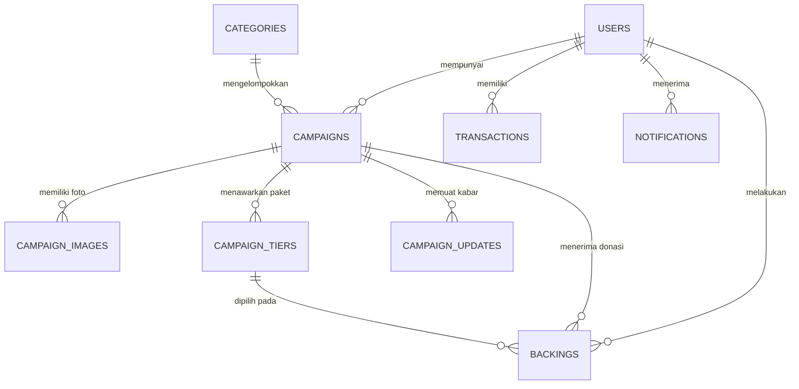

# Skema Basis Data CoFund

Dokumen ini memuat spesifikasi lengkap skema basis data sistem **CoFund** berdasarkan *Migration* dan *Model* Laravel yang aktif.

---

## 1. Diagram Relasi Entitas (ERD)

---

## 2. Enum & Tipe Data Standar

### A. `Role` (User Role)
- `'backer'`: Donatur default.
- `'creator'`: Inisiator pembuat kampanye.
- `'admin'`: Administrator pengelola platform.

### B. `CampaignStatus`
- `'draft'`: Kampanye baru dibuat oleh kreator, belum diajukan untuk ditinjau.
- `'review'`: Kampanye telah diajukan kreator dan sedang menunggu persetujuan admin.
- `'active'`: Kampanye telah disetujui admin dan sedang aktif menerima donasi pendanaan.
- `'success'`: Kampanye telah mencapai atau melebihi target dana pada saat deadline.
- `'failed'`: Kampanye tidak mencapai target dana pada saat deadline atau dibatalkan paksa (*force-fail*).

### C. `BackingStatus`
- `'pending'`: Donasi sedang diproses.
- `'completed'`: Donasi berhasil dan dana tersimpan di Virtual Escrow.
- `'refunded'`: Dana donasi telah dikembalikan ke saldo dompet donatur karena kampanye gagal.

### D. `TransactionType`
- `'deposit'`: Pengisian saldo dompet oleh pengguna.
- `'withdrawal'`: Penarikan saldo dompet ke rekening bank pengguna.
- `'payment'`: Pembayaran dukungan donasi ke kampanye (*holding in escrow*).
- `'refund'`: Pengembalian saldo dari kampanye gagal ke donatur.
- `'disbursement'`: Pencairan 95% dana kampanye sukses ke saldo kreator.
- `'platform_fee'`: Pemotongan 5% fee layanan platform dari kampanye sukses.

### E. `TransactionStatus`
- `'pending'`: Transaksi menunggu verifikasi/proses.
- `'success'`: Transaksi berhasil diselesaikan.
- `'failed'`: Transaksi gagal diproses.

---

## 3. Rincian Skema Tabel

### 1. Tabel `users`
Menyimpan data identitas, peran, saldo dompet, dan status akun pengguna.

| Kolom | Tipe Data | Keterangan / Constraint |
|---|---|---|
| `id` | BIGINT UNSIGNED (PK) | Auto increment |
| `name` | VARCHAR(255) | Nama lengkap pengguna |
| `email` | VARCHAR(255) | Email unik pengguna (UNIQUE) |
| `email_verified_at` | TIMESTAMP | Waktu verifikasi email (Nullable) |
| `password` | VARCHAR(255) | Hash password bcrypt |
| `role` | ENUM('backer','creator','admin') | Default: `'backer'` |
| `balance` | DECIMAL(15,2) | Saldo dompet virtual (Default: `0.00`) |
| `is_suspended` | BOOLEAN | Status penangguhan akun (Default: `false`) |
| `suspended_at` | TIMESTAMP | Waktu penangguhan (Nullable) |
| `remember_token` | VARCHAR(100) | Token remember me (Nullable) |
| `created_at` | TIMESTAMP | Waktu pembuatan |
| `updated_at` | TIMESTAMP | Waktu pembaruan |

---

### 2. Tabel `categories`
Menyimpan daftar kategori klasifikasi proyek kampanye.

| Kolom | Tipe Data | Keterangan / Constraint |
|---|---|---|
| `id` | BIGINT UNSIGNED (PK) | Auto increment |
| `name` | VARCHAR(255) | Nama kategori (misal: Teknologi & Inovasi) |
| `slug` | VARCHAR(255) | Slug URL unik (UNIQUE) |
| `description` | TEXT | Deskripsi kategori (Nullable) |
| `created_at` | TIMESTAMP | Waktu pembuatan |
| `updated_at` | TIMESTAMP | Waktu pembaruan |

---

### 3. Tabel `campaigns`
Menyimpan data proyek penggalangan dana yang dibuat oleh kreator.

| Kolom | Tipe Data | Keterangan / Constraint |
|---|---|---|
| `id` | BIGINT UNSIGNED (PK) | Auto increment |
| `user_id` | BIGINT UNSIGNED (FK) | Relasi ke `users.id` (Creator/Inisiator) |
| `category_id` | BIGINT UNSIGNED (FK) | Relasi ke `categories.id` |
| `title` | VARCHAR(255) | Judul kampanye |
| `slug` | VARCHAR(255) | Slug URL unik kampanye (UNIQUE) |
| `description` | TEXT | Ringkasan dan deskripsi lengkap proyek |
| `target_amount` | DECIMAL(15,2) | Target nominal dana yang dibutuhkan |
| `collected_amount` | DECIMAL(15,2) | Total dana yang telah terkumpul (Default: `0.00`) |
| `deadline` | DATE | Tanggal batas akhir penggalangan dana |
| `status` | ENUM | `'draft'`, `'review'`, `'active'`, `'success'`, `'failed'` (Default: `'draft'`) |
| `video_url` | VARCHAR(255) | Tautan video presentasi YouTube (Nullable) |
| `rejection_note` | TEXT | Catatan penolakan jika ditolak admin (Nullable) |
| `approved_by` | BIGINT UNSIGNED (FK) | Relasi ke `users.id` (Admin peninjau, Nullable) |
| `approved_at` | TIMESTAMP | Waktu persetujuan admin (Nullable) |
| `created_at` | TIMESTAMP | Waktu pembuatan |
| `updated_at` | TIMESTAMP | Waktu pembaruan |
| `deleted_at` | TIMESTAMP | Soft delete timestamp (Nullable) |

---

### 4. Tabel `campaign_images`
Menyimpan galeri foto visual pendukung kampanye (maksimal 5 foto per kampanye).

| Kolom | Tipe Data | Keterangan / Constraint |
|---|---|---|
| `id` | BIGINT UNSIGNED (PK) | Auto increment |
| `campaign_id` | BIGINT UNSIGNED (FK) | Relasi ke `campaigns.id` (CASCADE on delete) |
| `url` | VARCHAR(255) | Path file gambar yang tersimpan |
| `is_primary` | BOOLEAN | Penanda gambar utama kartu (Default: `false`) |
| `created_at` | TIMESTAMP | Waktu pembuatan |
| `updated_at` | TIMESTAMP | Waktu pembaruan |

---

### 5. Tabel `campaign_tiers` (Reward Tiers)
Menyimpan paket tingkat apresiasi atau reward untuk donatur.

| Kolom | Tipe Data | Keterangan / Constraint |
|---|---|---|
| `id` | BIGINT UNSIGNED (PK) | Auto increment |
| `campaign_id` | BIGINT UNSIGNED (FK) | Relasi ke `campaigns.id` (CASCADE on delete) |
| `name` | VARCHAR(255) | Nama paket reward (misal: Paket Early Bird) |
| `min_amount` | DECIMAL(15,2) | Batas minimum nominal donasi |
| `quota` | INT UNSIGNED | Kuota maksimal backer (`0` = Tanpa Batas) |
| `reward_description` | TEXT | Rincian benefit/fasilitas reward |
| `created_at` | TIMESTAMP | Waktu pembuatan |
| `updated_at` | TIMESTAMP | Waktu pembaruan |

---

### 6. Tabel `campaign_updates` (Blog Milestone Proyek)
Menyimpan postingan kabar berkala dan progres kampanye dari inisiator kepada donatur.

| Kolom | Tipe Data | Keterangan / Constraint |
|---|---|---|
| `id` | BIGINT UNSIGNED (PK) | Auto increment |
| `campaign_id` | BIGINT UNSIGNED (FK) | Relasi ke `campaigns.id` (CASCADE on delete) |
| `title` | VARCHAR(255) | Judul kabar proyek |
| `content` | TEXT | Isi artikel pembaruan kemajuan proyek |
| `created_at` | TIMESTAMP | Waktu pembuatan |
| `updated_at` | TIMESTAMP | Waktu pembaruan |

---

### 7. Tabel `backings`
Menyimpan data transaksi dukungan pendanaan dari donatur ke kampanye.

| Kolom | Tipe Data | Keterangan / Constraint |
|---|---|---|
| `id` | BIGINT UNSIGNED (PK) | Auto increment |
| `user_id` | BIGINT UNSIGNED (FK) | Relasi ke `users.id` (Backer/Donatur) |
| `campaign_id` | BIGINT UNSIGNED (FK) | Relasi ke `campaigns.id` |
| `tier_id` | BIGINT UNSIGNED (FK) | Relasi ke `campaign_tiers.id` (Nullable jika donasi bebas) |
| `amount` | DECIMAL(15,2) | Nominal dana yang didonasikan |
| `status` | ENUM | `'pending'`, `'completed'`, `'refunded'` (Default: `'completed'`) |
| `created_at` | TIMESTAMP | Waktu pembuatan |
| `updated_at` | TIMESTAMP | Waktu pembaruan |
| `deleted_at` | TIMESTAMP | Soft delete timestamp (Nullable) |

---

### 8. Tabel `transactions`
Menyimpan buku besar (*general ledger*) seluruh mutasi saldo akun.

| Kolom | Tipe Data | Keterangan / Constraint |
|---|---|---|
| `id` | BIGINT UNSIGNED (PK) | Auto increment |
| `user_id` | BIGINT UNSIGNED (FK) | Relasi ke `users.id` pemilik saldo |
| `type` | ENUM | `'deposit'`, `'withdrawal'`, `'payment'`, `'refund'`, `'disbursement'`, `'platform_fee'` |
| `amount` | DECIMAL(15,2) | Nominal mutasi saldo |
| `status` | ENUM | `'pending'`, `'success'`, `'failed'` (Default: `'success'`) |
| `reference` | VARCHAR(255) | Kode referensi unik transaksi (misal: `deposit_1725091234_1`) |
| `created_at` | TIMESTAMP | Waktu pembuatan |
| `updated_at` | TIMESTAMP | Waktu pembaruan |
| `deleted_at` | TIMESTAMP | Soft delete timestamp (Nullable) |

---

### 9. Tabel `notifications`
Menyimpan notifikasi sistem internal untuk pengguna.

| Kolom | Tipe Data | Keterangan / Constraint |
|---|---|---|
| `id` | BIGINT UNSIGNED (PK) | Auto increment |
| `user_id` | BIGINT UNSIGNED (FK) | Relasi ke `users.id` penerima notifikasi |
| `title` | VARCHAR(255) | Judul notifikasi |
| `message` | TEXT | Pesan notifikasi |
| `is_read` | BOOLEAN | Status terbaca (Default: `false`) |
| `created_at` | TIMESTAMP | Waktu pembuatan |
| `updated_at` | TIMESTAMP | Waktu pembaruan |
